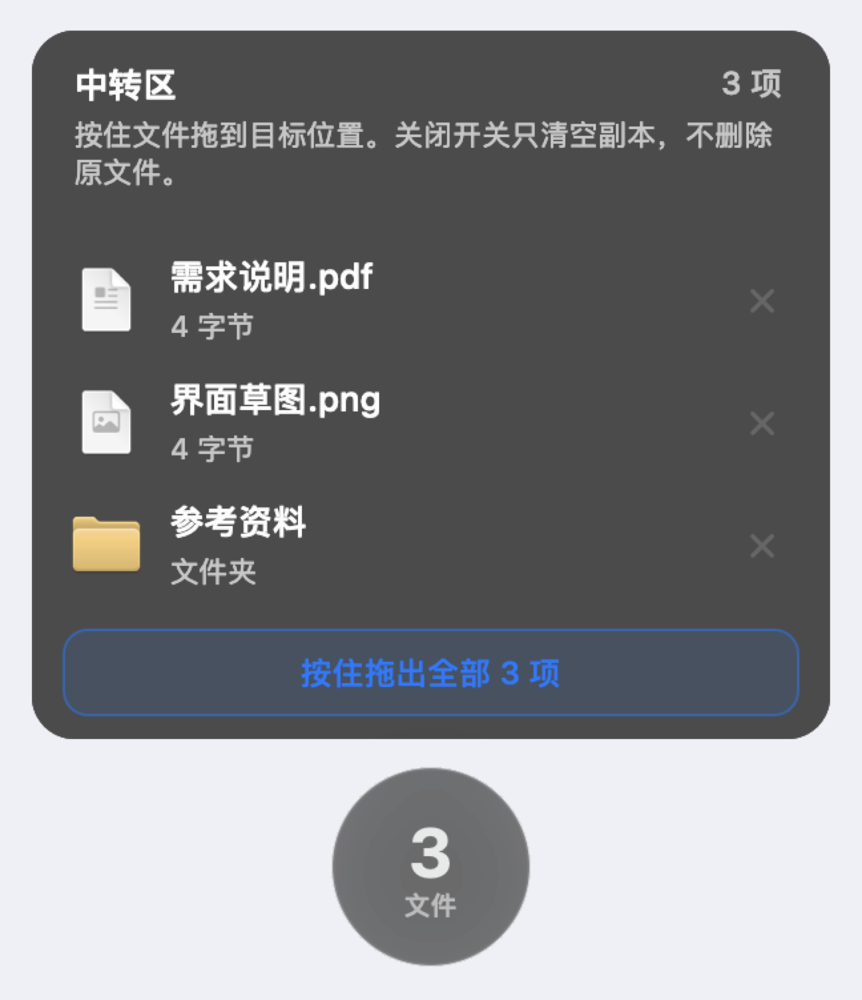

# 中转球

屏幕已经挤满的时候，把文件先放到悬浮球里，再用的时候拖进网页。

适合这种场景：浏览器开着 ChatGPT、Claude 或其他上传框，访达、文稿、桌面叠在一起，没法把文件直接拖进网页。中转球停在所有窗口上面，先接住文件，腾出手整理窗口后，再拖进网页。

拖进去的是副本。关掉悬浮球只会清空中转区，不会删除你原来的文件。

## 界面

菜单栏是一枚同心圆。关闭时中心是亮灰色，开启时中心是亮淡紫色。

| 关闭 | 开启 |
| --- | --- |
|  |  |

开启后，屏幕上出现毛玻璃悬浮球。数字是当前暂存的文件数。


点击悬浮球展开中转区。按住某一项，拖进浏览器的上传区域；也可以按住底部，一次拖出全部。



## 使用

1. 打开 `中转球.app`。它只出现在菜单栏，没有程序坞图标。
2. 点击菜单栏的同心圆，显示悬浮球。拖动球体可以换位置。
3. 把文件或文件夹拖进悬浮球。
4. 需要交给网页时，点击悬浮球，按住文件拖进 ChatGPT 等页面的输入框或上传区。
5. 点击悬浮球和列表以外的地方，列表会收起，文件仍留在球里。
6. 再点一次菜单栏图标，悬浮球消失，中转副本被清空。

右键菜单栏图标可以调整：

- **悬浮球大小**：小、中、大
- **透明程度**：较透、标准、较实
- **退出中转球**

按住 Option 再点击菜单栏图标，也会退出。

## 构建

需要 macOS 13 或更高版本，以及 Xcode 命令行工具。

```bash
cd 中转球
./build.sh
open ../中转球.app
```

`build.sh` 会编译菜单栏应用、做一次文件复制与清空的自测，并在上一级目录生成 `中转球.app`。

## 说明

- 放进悬浮球的是复制到临时目录的副本，拖出时也是复制，原文件留在原地。
- 关闭开关、退出应用，或下次启动时，都会清掉这些副本。
- 从网页或其他应用拖出的图片，如果没有文件路径，会存成 PNG 再供拖出。
